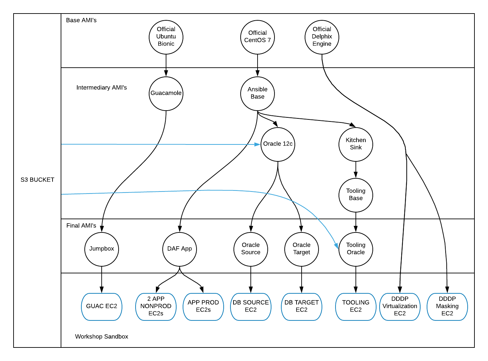

# Simple instructions for building the Toolchain Workshop Demo <!-- omit in toc -->

These have been prepared for Mac/Linux-based installations.

- [Workshop Walk-through Documentation](#workshop-walk-through-documentation)
- [Simple Installation](#simple-installation)
  - [Requirements](#requirements)
  - [Instructions](#instructions)

## Workshop Walk-through Documentation

You can view the workshop walk-through [here](https://delphix.github.io/toolchain-workshop-docs/300/)

## Simple Installation

### Requirements

1. Delphix Engine >= 5.3.6 shared in your AWS account and region
2. [Docker Compose](https://docs.docker.com/compose/install)
(If you cannot use Docker Compose, then you can opt for the [Advanced Install](#advancedinstall))
3. AWS bucket with:
    1. [Datical License file](https://www.datical.com) named datical_admin.lic
    2. [DaticalDB-linux.gtk.x86_64-2019.2.2.6029.jar](https://www.datical.com)
    3. Oracle 12.2.0.1.0 -> [linuxx64_12201_database.zip](https://www.oracle.com/technetwork/database/enterprise-edition/downloads/oracle12c-linux-12201-3608234.html)
    4. [oracle-instantclient12.2-basic-12.2.0.1.0-1.x86_64.rpm](https://www.oracle.com/technetwork/topics/linuxx86-64soft-092277.html)
    5. [oracle-instantclient12.2-tools-12.2.0.1.0-1.x86_64.rpm](https://www.oracle.com/technetwork/topics/linuxx86-64soft-092277.html)
    6. [oracle-instantclient12.2-jdbc-12.2.0.1.0-1.x86_64.rpm](https://www.oracle.com/technetwork/topics/linuxx86-64soft-092277.html)
    7. [oracle-instantclient12.2-sqlplus-12.2.0.1.0-1.x86_64.rpm](https://www.oracle.com/technetwork/topics/linuxx86-64soft-092277.html)
4. AWS access keys with permissions to read the s3 bucket from #3
5. AWS access keys to create and destroy EC2 objects (VPCs, subnets, SGs, ami's, instances, etc)
6. If executing from Windows, must use Linux Containers mode.

### Instructions

1. Download and extract the [latest release of this repo](https://github.com/delphix/dx-workshops/releases/latest)
2. Copy the .example.docker file to .docker.env and edit the variables to suit your environment (i.e. AWS keys and region) See #EnvironmentFile below
3. Open a terminal in the root of this repository
4. Build the demo AMI's in AWS via the Docker container (this process will take 45-60 minutes  
```docker-compose run tcw-oracle-oracle build```
1. Once the container completes, check for an ERROR.log or READY.log file. READY.log means the ami's were created successfully. ERROR.log means there was an issue. Please examine and resolve the issue and then start the process again. The build should resume from the last successful AMI.
2. Deploy the environment (this takes just a few minutes)  
```docker-compose run tcw-oracle-oracle deploy```
7. To get your environment information  
```docker-compose run tcw-oracle-oracle env```
8. The login username for the jumpbox is delphix, and the password is the value from the GUAC_USER_PASSWORD in your .docker.env
9. After the workshop is deployed, it can take 20-25 minutes for the environment automation to start and configure all of the components. There are two easy ways to check on the status of the workshop:
   1. Login to the jumpbox. When the file named WAIT on the desktop changes to READY, the workshop is ready to use. If the WAIT file changes to ERROR, something went wrong. This file is a log, you can open to inspect what happened.
   2. Use the built-in `ready` command. This command will tail the above log file and will return when the startup routine is correct.  
   ```docker-compose run tcw-oracle-oracle ready```
1.  When you are finished using your environment, teardown the environment  
```docker-compose run tcw-oracle-oracle destroy```

### Environment File

        AWS_ACCESS_KEY_ID=AAAAAAAAAAAAAAAAAAAA
    AWS_COSTCENTER=867-5309 - Who Do I Turn To
    AWS_EXPIRATION=2037-07-01
    AWS_KEYNAME=KEY NAME WITHOUT .pem
    AWS_OWNER=Adam Bowen
    AWS_PROJECT=AWS Workflow Automations
    AWS_REGION=us-west-2
    AWS_SECRET_ACCESS_KEY=BBBBBBBBBBBBBBBBBBBBBBBBBBBBBBBBBBBBBBBB
    AWS_SUBNET_ID=subnet-09f297f4c80d78eef
    AWS_VPC_ID=vpc-0acd2e06169cc859b
    #DELPHIX_ADMIN_PASSWORD Password must be between 6-12 characters and contain 1 digit, 1 uppercase alphabet character, and 1 special character
    DELPHIX_ADMIN_PASSWORD=Password-123
    DELPHIX_VERSION=5.3.6.*
    #GUAC_USER_PASSWORD must be at least 8 characters
    GUACADMIN_PASSWORD=flonkerton
    GUACAMOLE_DB_PASSWORD=foo
    GUAC_USER_PASSWORD=manamana
    MARIADB_ROOT_PASSWORD=bar
    S3_BUCKET=my-bucket
    S3_OBJECT_PATH=/files
    VNC_DEFAULT_PASSWORD=meepmeep

    #Optional
    #S3_AWS_ACCESS_KEY_ID=CCCCCCCCCCCCCCCCC
    #S3_AWS_SECRET_ACCESS_KEY=DDDDDDDDDDDDDDDDDDDDDDDDDDDDDDDDDDD
    #AWS_AZ=us-west-2a

## Image Build Flow

Below is a diagram of the build flow of the images used in this workshop.


## Second Simplest Installation

For those who cannot use Docker

### Requirements (Advanced Instructions)

1. Running Linux or a Mac, not been tested/validated with Windows-based control machines
2. Delphix Engine => 5.3.6 shared in your AWS account and region
3. AWS bucket with:
    1. [Datical License file](www.datical.com) named datical_admin.lic
    2. [DaticalDB-linux.gtk.x86_64-2019.2.2.6029.jar](www.datical.com)
    3. Oracle 12.2.0.1.0 -> [linuxx64_12201_database.zip](https://www.oracle.com/technetwork/database/enterprise-edition/downloads/oracle12c-linux-12201-3608234.html)
    4. [oracle-instantclient12.2-basic-12.2.0.1.0-1.x86_64.rpm](https://www.oracle.com/technetwork/topics/linuxx86-64soft-092277.html)
    5. [oracle-instantclient12.2-tools-12.2.0.1.0-1.x86_64.rpm](https://www.oracle.com/technetwork/topics/linuxx86-64soft-092277.html)
    6. [oracle-instantclient12.2-jdbc-12.2.0.1.0-1.x86_64.rpm](https://www.oracle.com/technetwork/topics/linuxx86-64soft-092277.html)
    7. [oracle-instantclient12.2-sqlplus-12.2.0.1.0-1.x86_64.rpm](https://www.oracle.com/technetwork/topics/linuxx86-64soft-092277.html)
4. AWS access keys with permissions to read the s3 bucket from #2
5. AWS access keys to create and destroy EC2 objects (VPCs, subnets, SGs, ami's, instances, etc)
6. [Ansible 2.8.2+](https://www.ansible.com/)
7. [Packer 1.4.2+](https://packer.io)
8. [Terraform >=0.12.5](https://terraform.io)
9. [git](https://git-scm.com/downloads)
10. [jq](https://stedolan.github.io/jq/)
11. [python 2.7](https://www.python.org)
12. [netaddr](https://pypi.org/project/netaddr)
13. [awscli 1.16.201+](https://aws.amazon.com/cli/)
14. [yq](https://github.com/mikefarah/yq)

### Instructions (Advanced Instructions)

1. Download and extract the [latest release of this repo](https://github.com/delphix/dx-workshops/releases/latest)
2. Copy the .example.env file to .environment.env and edit the variables to suit your environment (i.e. AWS keys and region) See #EnvironmentFile above
. Open a terminal in the root of this repository
3. Build the demo AMI's in AWS (this process will take 45-60 minutes)  
```demo-workshops/tcw-oracle-oracle/image-builder/packer_build.sh```
4. Once the build completes, check for an ERROR.log or READY.log file. READY.log means the ami's were created successfully. ERROR.log means there was an issue. Please examine and resolve the issue and then start the process again. The build should resume from the last successful AMI.
5. Deploy the environment (this takes just a few minutes)  
```demo-workshops/tcw-oracle-oracle/image-builder/terraform.sh apply```
6. To get your environment information  
```demo-workshops/tcw-oracle-oracle/image-builder/terraform.sh output environment```
7. The login username for the jumpbox is delphix, and the password is the value from the GUAC_USER_PASSWORD in your .docker.env
8. When the WAIT file changes to READY on the desktop, the workshop is ready to use. If the WAIT file changes to ERROR, then examine the file to see what error has occurred. (This can take 20-25 minutes)
9. When you are finished using your environment, teardown the environment  
```demo-workshops/tcw-oracle-oracle/image-builder/terraform.sh destroy```

### Upgrading

If you are pulling an updated copy of this repo:

1. Validate any updates to the environment variables
2. Force a rebuild of the docker container, just to be sure you have all the latest changes.  
```docker-compose run tcw-oracle-oracle build --no-cache```
3. Then follow from step 3 of [Simple Installation](#simple-installation)
