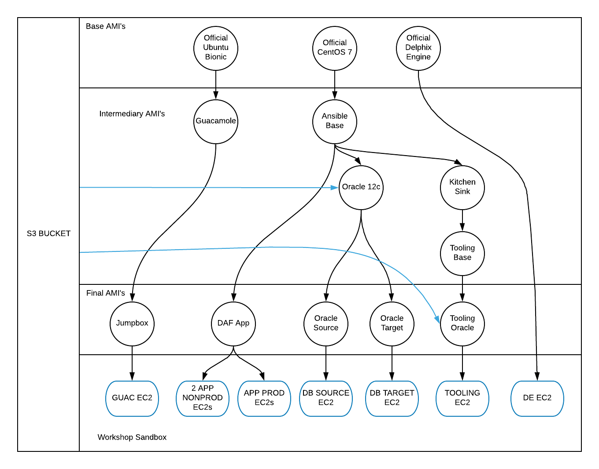

# Simple instructions for building the Toolchain Workshop Demo <!-- omit in toc -->

These have been prepared for Mac/Linux-based installations.

- [Workshop Walkthrough Documentation](#Workshop-Walkthrough-Documentation)
- [Simple Installation](#Simple-Installation)
  - [Requirements](#Requirements)
  - [Instructions](#Instructions)
  - [Environment File](#Environment-File)
- [Image Build Flow](#Image-Build-Flow)
- [Second Simplest Installation](#Second-Simplest-Installation)
  - [Requirements (Advanced Instructions)](#Requirements-Advanced-Instructions)
  - [Instructions (Advanced Instructions)](#Instructions-Advanced-Instructions)

## Workshop Walkthrough Documentation
You can view the workshop walkthrough [here](http://18.236.74.213/index.html)

## Simple Installation

### Requirements

1. Delphix Engine 5.3.2.* shared in your AWS account and region
2. [Docker Compose](https://docs.docker.com/compose/install)
(If you cannot use Docker Compose, then you can opt for the [Advanced Install](#advancedinstall))
3. AWS bucket with:
    1. [Datical License file](https://www.datical.com) named datical_admin.lic
    2. [DaticalDB-linux.gtk.x86_64-5.2.5347.jar](https://www.datical.com)
    3. Oracle 12.2.0.1.0 -> [linuxx64_12201_database.zip](https://www.oracle.com/technetwork/database/enterprise-edition/downloads/oracle12c-linux-12201-3608234.html)
    4. [oracle-instantclient12.2-basic-12.2.0.1.0-1.x86_64.rpm](https://www.oracle.com/technetwork/topics/linuxx86-64soft-092277.html)
    5. [oracle-instantclient12.2-tools-12.2.0.1.0-1.x86_64.rpm](https://www.oracle.com/technetwork/topics/linuxx86-64soft-092277.html)
    6. [oracle-instantclient12.2-jdbc-12.2.0.1.0-1.x86_64.rpm](https://www.oracle.com/technetwork/topics/linuxx86-64soft-092277.html)
    7. [oracle-instantclient12.2-sqlplus-12.2.0.1.0-1.x86_64.rpm](https://www.oracle.com/technetwork/topics/linuxx86-64soft-092277.html)
4. AWS access keys with permissions to read the s3 bucket from #3
5. AWS access keys to create and destroy EC2 objects (VPCs, subnets, SGs, ami's, instances, etc)

### Instructions

1. Download and extract the [latest release of this repo](https://github.com/delphix/packer-templates/releases/latest)
2. Copy the .example.docker file to .docker.env and edit the variables to suit your environment (i.e. AWS keys and region) See #EnvironmentFile below
3. Open a terminal in the root of this repository
4. Build the demo AMI's in AWS via the Docker container (this process will take 45-60 minutes ```docker-compose run tcw build```
5. Once the container completes, check for an ERROR.log or READY.log file. READY.log means the ami's were created successfully. ERROR.log means there was an issue. Please examine and resolve the issue and then start the process again. The build should resume from the last successful AMI.
6. Deploy the environment (this takes just a few minutes) ```docker-compose run tcw deploy```
7. To get your environment information ```docker-compose run tcw env```
8. The login username for the jumpbox is delphix, and the password is the value from the GUAC_USER_PASSWORD in your .docker.env
9. When the WAIT file changes to READY on the desktop, the workshop is ready to use. If the WAIT file changes to ERROR, then examine the file to see what error has occurred. (This can take 20-25 minutes)
10. When you are finished using your environment, teardown the environment ```docker-compose run tcw destroy```

### Environment File

    AWS_ACCESS_KEY_ID: AWS Access Key to create EC2 objects (VPCs, subnets, SGs, ami's, instances, etc)
    AWS_COSTCENTER: Optional field for tagging purposes
    AWS_EXPIRATION: Optional field for tagging purposes
    AWS_KEYNAME: The name of the AWS Key Pair to use (don't include .pem extension)
    AWS_OWNER: Optional field for tagging purposes
    AWS_PROJECT: Optional field for tagging purposes
    AWS_REGION: AWS region to create and deploy assets
    AWS_SECRET_ACCESS_KEY: AWS Secret Key to create EC2 objects
    AWS_SUBNET_ID: AWS subnet ID to use to create AMI's
    AWS_VPC_ID: AWS VPC ID to use to create AMI's
    DELPHIX_ADMIN_PASSWORD: The password to set the Delphix delphix_admin user
    GUACADMIN_PASSWORD: The password to set for the Guacamole guacadmin user
    GUACAMOLE_DB_PASSWORD: The password to set for the guacamole database
    GUAC_USER_PASSWORD: The password to set for the Guacamole delphix user
    MARIADB_ROOT_PASSWORD: The password to set for the root user in the mariadb
    S3_BUCKET: The S3 bucket that contains the required binaries
    S3_OBJECT_PATH: The path in the S3 bucket where the binaries are located (leave blank if in root of bucket)
    VNC_DEFAULT_PASSWORD: The default password for VNC

Leave the following two values commented out, if you will use the same as AWS_ACCESS_KEY_ID

    S3_AWS_ACCESS_KEY_ID: AWS Access Key to access S3_BUCKET
    S3_AWS_SECRET_ACCESS_KEY: AWS Secret Key to access S3_BUCKET
    AWS_AZ: AWS availability zone to deploy into (defaults to "${AWS_REGION}a" if left commented out)

## Image Build Flow
Below is a diagram of the build flow of the images used in this workshop.


## Second Simplest Installation

For those who cannot use Docker

### Requirements (Advanced Instructions)

1. Running Linux or a Mac, not been tested/validated with Windows-based control machines
2. Delphix Engine 5.3.2.* shared in your AWS account and region
3. AWS bucket with:
    1. [Datical License file](www.datical.com) named datical_admin.lic
    2. [DaticalDB-linux.gtk.x86_64-5.2.5347.jar](www.datical.com)
    3. Oracle 12.2.0.1.0 -> [linuxx64_12201_database.zip](https://www.oracle.com/technetwork/database/enterprise-edition/downloads/oracle12c-linux-12201-3608234.html)
    4. [oracle-instantclient12.2-basic-12.2.0.1.0-1.x86_64.rpm](https://www.oracle.com/technetwork/topics/linuxx86-64soft-092277.html)
    5. [oracle-instantclient12.2-tools-12.2.0.1.0-1.x86_64.rpm](https://www.oracle.com/technetwork/topics/linuxx86-64soft-092277.html)
    6. [oracle-instantclient12.2-jdbc-12.2.0.1.0-1.x86_64.rpm](https://www.oracle.com/technetwork/topics/linuxx86-64soft-092277.html)
    7. [oracle-instantclient12.2-sqlplus-12.2.0.1.0-1.x86_64.rpm](https://www.oracle.com/technetwork/topics/linuxx86-64soft-092277.html)
4. AWS access keys with permissions to read the s3 bucket from #2
5. AWS access keys to create and destroy EC2 objects (VPCs, subnets, SGs, ami's, instances, etc)
6. [Ansible 2.7.9+](https://www.ansible.com/)
7. [Packer 1.3.5+](https://packer.io)
8. [Terraform 0.11.X](https://terraform.io) **Not tested with 0.12.X
9. [git](https://git-scm.com/downloads)
10. [jq](https://stedolan.github.io/jq/)
11. [python 2.7](https://www.python.org)
12. [netaddr](https://pypi.org/project/netaddr)
13. [awscli 1.16.149+](https://aws.amazon.com/cli/)

### Instructions (Advanced Instructions)

1. Download and extract the [latest release of this repo](https://github.com/delphix/packer-templates/releases/latest)
2. Copy the .example.env file to .environment.env and edit the variables to suit your environment (i.e. AWS keys and region) See #EnvironmentFile above
. Open a terminal in the root of this repository
3. Build the demo AMI's in AWS (this process will take 45-60 minutes)
```demo-workshops/tcw/image-builder/packer_build.sh```
5. Once the build completes, check for an ERROR.log or READY.log file. READY.log means the ami's were created successfully. ERROR.log means there was an issue. Please examine and resolve the issue and then start the process again. The build should resume from the last successful AMI.
6. Deploy the environment (this takes just a few minutes)
```demo-workshops/tcw/image-builder/terraform.sh apply```
1. To get your environment information
```demo-workshops/tcw/image-builder/terraform.sh output environment```
8. The login username for the jumpbox is delphix, and the password is the value from the GUAC_USER_PASSWORD in your .docker.env
9. When the WAIT file changes to READY on the desktop, the workshop is ready to use. If the WAIT file changes to ERROR, then examine the file to see what error has occurred. (This can take 20-25 minutes)
10. When you are finished using your environment, teardown the environment
```demo-workshops/tcw/image-builder/terraform.sh destroy```